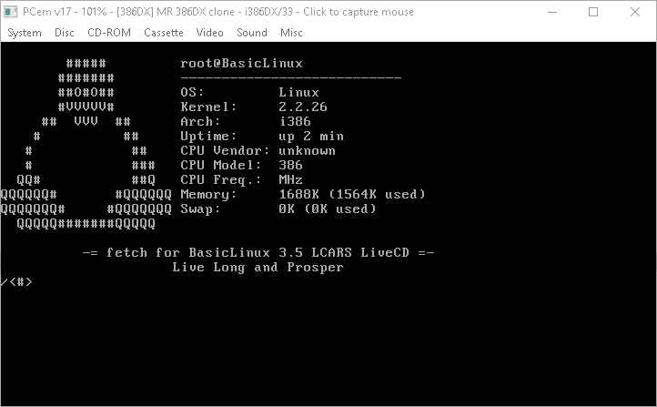
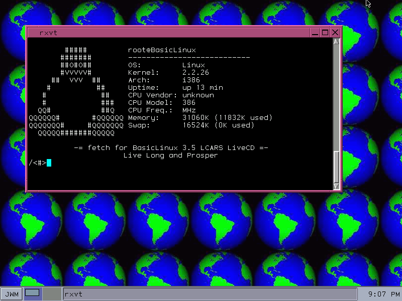

# BasicLinux 3.5 LCARS

**L**ive **C**D **A**nd **R**escue **S**ystem

*Sister project to [LCARS-DOS](https://github.com/queenkjuul/LCARS)*

Perhaps the only bootable Linux LiveCD that can run on a 386 with 4MB of RAM. Works whether your machine can CD-boot or not.

It almost defies belief, but the LiveCD will technically boot in just 3MB, with just enough free RAM to load ethernet drivers and run basic utilities. 4MB provides a fully functional shell environment complete with text-mode web browsing, while 8MB provides for a relatively complete desktop environment.



This LCARS distribution of BasicLinux 3.5 aims to provide:

- A complete LiveCD desktop environment
- A complete installable desktop environment
- A complete low-memory shell environment (386 + 4MB)
- An expansive on-disc package repository for post-install customization
- Easy to use, mostly-automatic experience, with on-disc documentation

Old versions of DamnSmallLinux were optimized more for overall image size, and less for total RAM use, and thus require 16MB of RAM (though some versions do at least support 386 explicitly). Running an actual 90s distro means you lose a lot of features and drivers, plus none of them were really designed for LiveCD use. Any vaguely modern LiveCD is going to require far too much RAM. BasicLinux strikes a great balance of modern features and ancient compatibility. This distribution of BasicLinux makes no attempt to keep the overall filesystem small, instead trying to provide as many useful software packages as possible on a single CD.

The system boots via MS-DOS, so it can be started from the CD itself on native CD-booting BIOSes (including some SCSI BIOS), from an MS-DOS boot floppy (image included), or from an MS-DOS installation already present on a hard drive. Even Windows 9x (when booted into DOS mode) can boot the LiveCD.

Tested on a real-life 386DX-40 with 8MB of RAM, and an emulated "MR 386DX Clone" with 4MB of RAM, as well as various more "modern" real-metal x86 systems. Compatibility seems good in general, but if PCem is accurate, some particularly old 386 BIOSes may not be compatible, and the [optional] MS-DOS USB drivers may interfere with kernel init on certain systems.

- [BasicLinux 3.5 LCARS](#basiclinux-35-lcars)
  - [System Requirements](#system-requirements)
    - [Minimum](#minimum)
    - [Optional](#optional)
  - [Features](#features)
    - [BasicLinux native features](#basiclinux-native-features)
    - [LiveCD Features](#livecd-features)
      - [BasicLinux `fetch`](#basiclinux-fetch)
  - [Booting](#booting)
    - [IDE/ATAPI CDROM](#ideatapi-cdrom)
    - [SCSI CDROM](#scsi-cdrom)
    - [USB CDROM](#usb-cdrom)
    - [Non-CD-Bootable BIOS](#non-cd-bootable-bios)
    - [USB Keyboard and Mouse](#usb-keyboard-and-mouse)
    - [Boot Parameters](#boot-parameters)
    - [Swap](#swap)
  - [Usage](#usage)
    - [Additional Hardware](#additional-hardware)
    - [Network](#network)
    - [Xvesa](#xvesa)
    - [Gimp](#gimp)
    - [glibc2 and Opera](#glibc2-and-opera)
    - [Java](#java)
  - [Installation](#installation)
    - [Transfer LiveCD System to MS-DOS installation](#transfer-livecd-system-to-ms-dos-installation)
    - [Install alongside MS-DOS to an ext2 partition](#install-alongside-ms-dos-to-an-ext2-partition)
  - [Customization](#customization)

## System Requirements

### Minimum

- 386-class CPU
- 4MB RAM
- CD-ROM drive

### Optional

- 8MB RAM (to run Xvesa)
- Floppy drive (for non-CD-bootable BIOS, or to load SCSI/USB CD-ROM drivers)
- Mouse (for Xvesa)
- 320MB+ free HDD space (for permanent installation)

## Features

### BasicLinux native features

The upstream BasicLinux project ships with:

- Linux kernel 2.2.26
- Busybox 1.01
- Xvesa
- JWM
- e3 editor (emulates vi/pico/wordstar)
- Slackware 4.0 package compatibility
- Installable to HDD (dual boot with MS-DOS, with or without a separate partition)

### LiveCD Features

- All BasicLinux official add-on packages
  - Includes large suite of installed software, including:
    - Network software (dropbear, httpd, smbclient, samba, netatalk, rsync, TkVNC)
    - Utilities (cdutils, ImageMagick, hfsutils, mpg123, mplayer, mc, Xcdroast)
    - Development tools (gcc, automake, yabasic, perl, python 1.5, Tcl/Tk 8.6, JDK 1.1.7/Java 7)
    - Desktop applications (AbiWord, Gimp, Xpaint, TkDesk, MagicPoint)
    - Games (Xfreecell, LinCity, Freecell, and tons more)
    - And many more!
- All BasicLinux official add-on kernel modules
- Full Slackware 4.0 binary package repository*
  - *the standard packages are there, but `xemacs`, `gnome`, and additional X drivers are omitted
- As many BasicLinux "contrib" packages as could be located and fit on-disc
- Boots from SCSI and USB CD drives using a boot floppy
- Bootable MS-DOS rescue environment
  - Based on Windows 98 Setup Boot Disk
  - Includes CD-ROM drivers
  - Includes:
    - EDIT.COM
    - FDISK
    - FORMAT (Win98)
    - PKZIP/PKUNZIP
    - SCANDISK (Win98)
    - XCOPY
    - Some "UNIX"-iness: GREP, LS, RM, TREE
  
#### BasicLinux `fetch`

for your /r/vintagecomputing screenshots, you can run `fetch` on the LiveCD. (also, I'd love to see them - open an Issue, I guess?)

```
        #####         qkj@MainBridge
       #######        --------------------------------
       ##O#O##        OS:         Linux
       #VVVVV#        Kernel:     5.15.167.4-microsoft-standard-WSL2
     ##  VVV  ##      Arch:       x86_64
    #          ##     Uptime:     up 17:37
   #            ##    CPU Vendor: AuthenticAMD
   #            ###   CPU Model:  AMD Ryzen 7 5800X 8-Core Processor
  QQ#           ##Q   CPU Freq.:  3792.876 MHz
QQQQQQ#       #QQQQQQ Memory:     788892K (7294836K used)
QQQQQQQ#     #QQQQQQQ Swap:       0K (2097152K used)
  QQQQQ#######QQQQQ

          -= fetch for BasicLinux 3.5 LCARS LiveCD =-
                     Live Long and Prosper
```



## Booting

### IDE/ATAPI CDROM

If your BIOS boots from CD natively, you don't need to do anything. Just put the CD in the drive and let it rip.

If you can't boot from CD directly, don't worry, you can [boot from a floppy](#non-cd-bootable-bios)

### SCSI CDROM

You need to prepare a "drivers install disk" which contains the necessary kernel modules for your CD drive, plus a shell script that installs them and mounts the drive. This is NOT the same disk as the `cdboot.ima` floppy - for SCSI/USB, you may need two floppies.

Don't fret, it's easier than it sounds. See [`/driverdisk`](driverdisk/) for an example of how to lay out your diskette. It should be MSDOS (FAT12/FAT16) formatted. Available modules are listed in [`/livecd/modules`](livecd/modules/).

If you can't boot from SCSI directly, don't worry, you can [boot from a floppy](#non-cd-bootable-bios).

### USB CDROM

This isn't tested, but the MS-DOS bootloader environment includes USB CDROM and USB HDD (flash drive) drivers. So, if you can work out what kernel modules you need, you should be able to craft a "driver install disk" that tells the Linux kernel how to load the root filesystem image from your USB CD. See [`/driverdisk`](driverdisk/) for details and examples. Use the "USB mode" menu options at boot time.

### Non-CD-Bootable BIOS

The system boots via MS-DOS. As long as your MS-DOS installation can access the CD-ROM, and the files `LOADLIN.EXE`, `ZIMAGE`, and `INIITFS.GZ`, then it can boot the system. If you can write the `CDBOOT.IMA` disk image to floppy (hint: `RAWRITE.EXE` in [`/cdboot`](cdboot/) can do that on DOS), then the boot disk will attempt to locate your CD-ROM drive and boot from there. Otherwise, if your MS-DOS can reach the `BASLIN` directory on the CD, just run `BOOT.BAT` or `SCSI.BAT`. A Windows 9x boot floppy is perfectly capable of booting the system, as is the Windows 9x MS-DOS boot mode on a hard drive.

### USB Keyboard and Mouse

The system is designed for ancient computers, so it assumes you are using PS/2 or Serial mice. However, the system is capable of using USB mice and keyboards without issue. Simply choose the relevant "DOS Prompt" mode from the boot menu (IDE/ATAPI, SCSI, or USB) and then when dropped into the `Z:\BASLIN` prompt, run `boot.bat usbhid` (or `scsi.bat usbhid`).

You can always pass the kernel command line parameter `usbhid` when you're booting from the DOS prompt (`BOOT.BAT`, `SCSI.BAT`, `HDBOOT.BAT`)

### Boot Parameters

The various boot scripts (`BOOT.BAT`, `SCSI.BAT`, `HDBOOT.BAT`) all accept arguments which are passed to the kernel command line.

The following parameters are available:

`usbhid` - install USB mouse+keyboard drivers at boot time

`usbstor` - install USB storage drivers at boot time

`ide-cd` - install IDE CD-ROM drivers at boot time (default in `BOOT.BAT`/LiveCD)

`swapoff` - do not look for swap files on DOS partitions at boot

`norootverify` - skip root filesystem check at boot

### Swap

For severely RAM-restricted systems with an existing MS-DOS hard disk installation, you can place `SWAP.IMG` (unzip `SWAP.ZIP` on the LiveCD) as `C:\BASLIN\SWAP.IMG`, and as long as your MS-DOS partition is the first partition on the first disk, BasicLinux will find and utilize the swap file. This is not tested nor expected to work with SCSI drives, unless you  manually figure it out in your `drivers.sh` file.

## Usage

The boot CD has all official BasicLinux packages installed and all modules available. Not all of them have X11 menu shortcuts, so check out the various `$PATH` directories to see what's available.

The system boots with a read-only root filesystem.

BasicLinux eschews the traditional multi-user UNIX paradigm in favor of just dumping you straight in a root shell with no password. It's basically Linux for DOS users: `/etc/rc` is functionally your `CONFIG.SYS`. `/etc/profile` (or `/root/.profile`, I guess) is your `AUTOEXEC.BAT`.

After installation to hard drive, you can install Slackware 4.0 packages (located on `LiveCD/packages/slackwar`) by running `pkg package.tgz`

### Additional Hardware

See `/etc/rc` for examples on how to load drivers for additional hardware. While you cannot modify the file in the read-only live environment, you can manually run the commands described in the file to load drivers for your hardware.

The BasicLinux docs at [`/livecd/docs/sound.html`](livecd/docs/sound.html) describe how to set up sound cards.

There are additional X graphics drivers available for use after HDD installation, see [the BasicLinux docs](livecd/docs/xvesa.html).

While the original BasicLinux installation did not include `modprobe`, BasicLinux LCARS does. This means you don't need to manually sort out module dependencies. When reading BasicLinux documentation, or trying to load drivers for your specific hardware from `livecd/modules`, use `modprobe` in place of `insmod`. This will generally help, though you can fall back to `insmod` if `modprobe` is failing to locate the driver (though, everything on the LiveCD is in `/lib/modules/2.2.26/misc`, so `modprobe` should find them).

### Network

See `/root/netsetup` for examples of how to set up a network card. If you install the system to HDD, you can modify `/etc/rc` to automatically initialize the network on boot.

As mentioned above, you can use `modprobe` instead of `insmod` from the LiveCD to automatically install module dependencies.

For example, while the BasicLinux docs specify:

    insmod 8390
    insmod ne io=0x300

With the LiveCD you can simply:

    modprobe ne io=0x300

As of Beta 1 Revision 4, network drivers work, but there are issues with DNS and `smbfs`. These will be fixed in Revision 5.

### Xvesa

Running `startx` from the LiveCD will run a script asking for your X config parameters. `jwm` and `icewm` are installed by default. Only PS/2 and Serial (COM1/COM2) mice are supported by default.

After installing to the HDD, `startx` will automatically save your X configuration choices in `/etc/Xconfig`. If you need to adjust your configuration, edit that file; you can also delete the file entirely and re-run `startx` to generate a new config. Running `NOSAVEX=true startx` will run the script without saving your chosen config, even on an HDD installation.

You can specify anything you want for when prompted for a window manager. Whatever you type there will be called as `exec $INPUT` by the next stage of the X init.

### Gimp

Gimp wants to load all of its Pattern files into RAM at startup. The version of Gimp shipped with BasicLinux includes 10MB of pattern files. Thus, no system with less than 12MB of RAM stands a chance of running Gimp out of the box.

To remove this requirement, all of the pattern files have been moved onto a disk image. By default, Gimp will see an empty `patterns/` directory, and will function within 8MB of RAM. If you have more than 12MB of RAM and want to use patterns in Gimp, you can run:

    mount -o loop /usr/share/gimp/patterns.img /usr/share/gimp/patterns

On a hard drive installation, you could then copy only the patterns you want to `~/.gimp/patterns` and unmount the disk image. This would conserve RAM while allowing you to still use the patterns feature.

### glibc2 and Opera

BasicLinux documentation indicates that Opera 8 will work with BasicLinux, if you first install the glibc2 packages from Slackware 9. The two library packages are in `LiveCD/extras/slackware-9.0`.

Opera 8.54 has been found! A mirror of all of the Opera Linux builds for versions 7-9 that I found is included in the repo in `/contrib/opera` and 8.54 is included on the LiveCD at `LiveCD/extra/opera8.tbz`

~~Unfortunately, I have been unable to locate a copy of Opera 8 for Linux. I have included Opera 7.54 instead. It is not yet tested.~~

~~If you find Opera 8 for Linux, statically linked for Qt (opera-8.xx-YYYYMMDD-static-qt-i386.tar.gz) please open an Issue and let me know.~~

See the BasicLinux documentation on-disc (`LiveCD/docs`) for more info.

### Java

JDK 1.1.7 is included in `/usr/local/java` and the `java` binary is included in the PATH. This JDK distribution (originating from Slackware 4.0) includes custom wrapper scripts which are not compatible with BusyBox. I have not 'backported' the fixes (commenting out offending lines) to the actual `java-1.1.7.tar.gz` package included on-disc, so be warned, using that package directly will not work. You may (or probably not) have luck using the included Bash in place of the stock BusyBox shell, or if you've installed to HDD, installing more of the Slackware base system. It's probably better just to inspect the provided [`rootfs/usr/local/java/bin/java`](rootfs/usr/local/java/bin/java) and [`/usr/local/java/bin/checkVersions`](rootfs/usr/local/java/bin/checkVersions) files and apply the changes on a new install.

## Installation

The system can be installed to a hard drive.

Installing to hard drive opens the opportunity to use alternative kernels or install additional Slackware 4.0 packages, which are located at `LivcCD/packages/slackwar` and installed by `pkg package.tgz`. The kernels should be placed next to `LOADLIN.EXE` and renamed to `ZIMAGE` (no extension), the extension of the file indicates what system it should be used with.

There are two ways to do install to HD:

### Transfer LiveCD System to MS-DOS installation

As the LiveCD itself boots via MS-DOS using `LOADLIN.EXE`, you can store the entire system on an MS-DOS partition and boot it from the DOS prompt as well.

The downside is that your root filesystem is limited to the 320MB LiveCD image file. Unfortunately BasicLinux 3.5 is so old as to predate `resize2fs`, so you're on your own as far as expanding the default root image. While the LiveCD image is ~300MB, only ~32MB of that is free space, so expect to store files on your MS-DOS partitions.

The easy way to install to DOS from the LiveCD is as follows:

1. Boot the LiveCD and choose Option 3: Enter DOS Prompt
2. `mkdir C:\BASLIN`
3. `xcopy Z:\BASLIN C:\BASLIN` (press D when asked "file or directory")
4. (recommended, requires 16MB) `xcopy Z:\SWAP.ZIP C:\BASLIN\SWAP.ZIP;PKUNZIP C:\BASLIN\SWAP.ZIP`
5. Reboot to MS-DOS from HDD
6. `cd C:\BASLIN;HDBOOT.BAT`

### Install alongside MS-DOS to an ext2 partition

***CURRENTLY UNSUPPORTED, YOUR MILEAGE MAY VARY***

The install script works, but it does not create a boot floppy, fails to install a bootloader to the HDD, and misinforms the user as to how to boot the system. That said, it does successfully transfer the system to the ext2 partition, which can be booted manually with `LOADLIN`.

1. Create a new partition on your HDD using the LiveCD or MS-DOS `FDISK`
2. Format it as ext2 (`mke2fs /dev/hdxX`, probably `/dev/hda2` or `/dev/hda5`)
3. Mount it to `/hd` (`mount /dev/hdxX /hd`)
4. Run the install script: `install-to-hd`
5. Follow the prompts on screen

The installer will prompt you to create a boot floppy. This is recommended; alternatively, you can boot the HD installation from the LiveCD by choosing Option 3: "Enter DOS Prompt" and running:

    loadlin zimage root=/dev/hdxX rw

Where `hdxX` is where you installed BasicLinux, probably `hda2` or `hda5`

## Customization

See [`/livecd/extras`](livecd/extras/)
